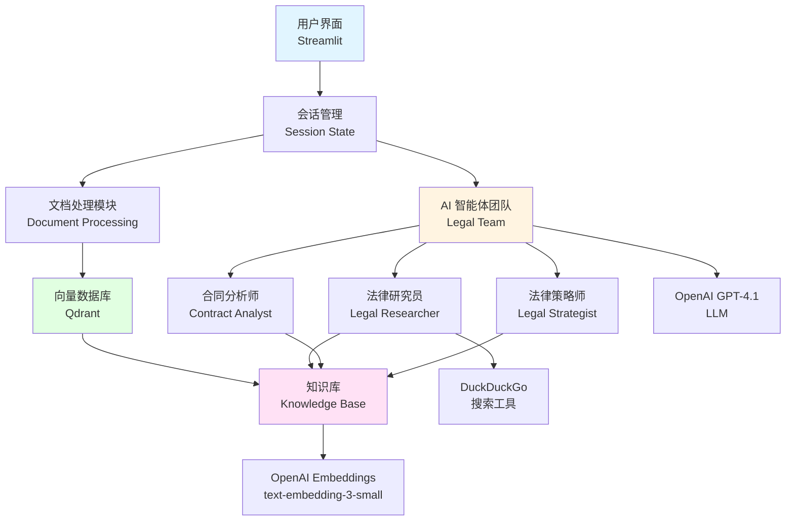
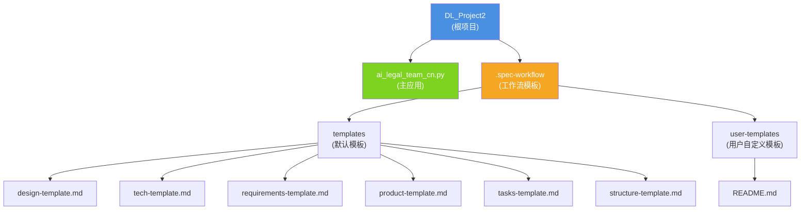
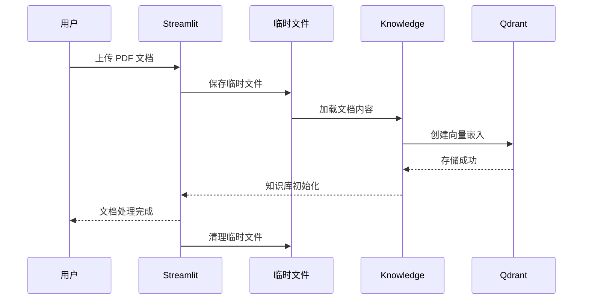

# AI 法律文档分析助手 - 项目架构文档

---

## 变更记录 (Changelog)

### 2026-01-15 19:03:51
- 初始化项目架构文档
- 完成全仓扫描与分析
- 生成模块结构图和索引

---

## 项目愿景

AI 法律文档分析助手是一个基于多智能体系统的法律文档智能分析平台。项目旨在通过 AI 技术为法律从业者提供高效的文档审查、法律研究、风险评估和合规性检查能力。

核心价值：
- **智能协作**：通过专业化 AI 智能体团队协同工作，提供全方位的法律分析
- **知识增强**：结合向量数据库实现文档语义检索和知识库增强
- **多维分析**：支持合同审查、法律研究、风险评估、合规性检查等多种分析场景
- **用户友好**：基于 Streamlit 构建直观的 Web 界面，简化 AI 使用门槛

---

## 架构总览

### 技术栈

| 类别 | 技术选型 |
|------|---------|
| **前端框架** | Streamlit (Python Web UI) |
| **AI 框架** | Agno (Agent & Team 协作框架) |
| **LLM** | OpenAI GPT-4.1 (通过 zhizengzeng.com API) |
| **向量数据库** | Qdrant |
| **向量嵌入** | OpenAI text-embedding-3-small |
| **搜索工具** | DuckDuckGo Tools |
| **运行时** | Python 3.x |

### 系统架构



---

## 模块结构图



---

## 模块索引

| 模块路径 | 类型 | 职责描述 | 语言 |
|---------|------|---------|------|
| `ai_legal_team_cn.py` | 主应用 | Streamlit Web 应用，实现文档上传、AI 团队初始化和多维度法律分析 | Python |
| `.spec-workflow/templates/` | 配置模板 | 包含设计、技术、需求、产品、任务和结构文档模板，用于规范化开发流程 | Markdown |
| `.spec-workflow/user-templates/` | 自定义模板 | 用户可覆盖的模板目录，支持项目特定的文档结构定制 | Markdown |

---

## 运行与开发

### 环境要求

```bash
# Python 依赖 (推断)
pip install streamlit
pip install agno
pip install qdrant-client
pip install openai
```

### 启动应用

```bash
streamlit run ai_legal_team_cn.py
```

### 配置说明

应用需要配置以下 API 密钥（在侧边栏输入）：
- **OpenAI API Key**: 用于 LLM 和嵌入模型
- **Qdrant API Key**: 向量数据库访问密钥
- **Qdrant URL**: Qdrant 实例地址

---

## 核心功能

### 1. 文档处理流程



### 2. AI 智能体团队

| 智能体 | 角色 | 核心能力 | 专用工具 |
|-------|------|---------|---------|
| **法律研究员** | 法律研究专家 | 查找案例、判例引用、研究摘要 | DuckDuckGo 搜索 |
| **合同分析师** | 合同审查专家 | 条款识别、问题分析、关键条款引用 | 知识库检索 |
| **法律策略师** | 策略规划专家 | 风险评估、策略制定、执行建议 | 知识库检索 |
| **法律团队负责人** | 协调者 | 团队协调、全面分析、质量把控 | 团队管理 |

### 3. 分析类型

- **合同审查**：专注于条款和义务的详细分析
- **法律研究**：相关法律案例和判例的研究
- **风险评估**：综合风险分析和战略评估
- **合规性检查**：全面的合规性分析
- **自定义查询**：用户自定义问题分析

---

## 测试策略

### 当前状态
- ❌ 无单元测试
- ❌ 无集成测试
- ❌ 无端到端测试
- ❌ 无 CI/CD 配置

### 建议改进
1. 添加pytest测试框架
2. 为核心函数添加单元测试：
   - `init_qdrant()`
   - `process_document()`
   - 各 Agent 初始化逻辑
3. 添加文档处理的集成测试
4. 使用 Streamlit Testing 进行 UI 测试

---

## 编码规范

### Python 代码规范
- 遵循 PEP 8 风格指南
- 使用类型注解（Type Hints）
- 函数文档字符串（Docstrings）
- 异常处理需有明确错误消息

### 命名约定
- **文件名**: `snake_case.py`
- **函数名**: `snake_case`
- **类名**: `PascalCase`
- **常量**: `UPPER_SNAKE_CASE`

### 会话状态管理
- 使用 `st.session_state` 管理全局状态
- 初始化逻辑集中在 `init_session_state()`
- 避免重复初始化已处理的文档

---

## AI 使用指引

### 对于 Claude / AI 助手

#### 项目结构理解
这是一个**单文件 Streamlit 应用**，核心逻辑集中在 `ai_legal_team_cn.py`：
- 所有导入在文件顶部
- 会话管理 → 向量数据库初始化 → 文档处理 → AI 团队创建 → 用户交互

#### 常见任务指引

**添加新的分析类型**：
1. 在 `analysis_configs` 字典中添加新条目
2. 定义 `query`（分析提示词）和 `agents`（参与的智能体）
3. 更新 `st.selectbox` 选项列表

**添加新的 AI 智能体**：
1. 创建新的 `Agent` 实例
2. 配置 `name`, `role`, `model`, `tools`, `knowledge`
3. 添加到 `Team` 的 `members` 列表

**修改知识库行为**：
- 当前使用 `Knowledge` 类 + `Qdrant` 向量数据库
- 嵌入模型：`text-embedding-3-small`
- 集合名称：`COLLECTION_NAME = "legal_documents"`

**调试建议**：
- 启用 `debug_mode=True` 查看 Agent 执行详情
- 检查 Qdrant 连接状态
- 验证 OpenAI API 密钥有效性

---

## 工作流模板说明

项目包含 `.spec-workflow` 目录，提供标准化的开发文档模板：

| 模板 | 用途 |
|-----|------|
| `requirements-template.md` | 需求文档模板，定义功能性和非功能性需求 |
| `design-template.md` | 设计文档模板，描述架构、组件和数据模型 |
| `tech-template.md` | 技术栈模板，记录技术选型和依赖 |
| `product-template.md` | 产品概述模板，定义产品愿景和指标 |
| `tasks-template.md` | 任务清单模板，细化开发任务和提示词 |
| `structure-template.md` | 项目结构模板，规范目录组织和命名 |

### 自定义模板
在 `.spec-workflow/user-templates/` 目录创建同名文件可覆盖默认模板。

---

## 已知限制

1. **单文件架构**：所有逻辑集中在一个 400 行文件中，建议模块化拆分
2. **无持久化**：会话状态在页面刷新后丢失
3. **文档类型限制**：当前仅支持 PDF 格式
4. **无用户管理**：无身份认证和权限控制
5. **无测试覆盖**：缺乏自动化测试
6. **硬编码配置**：API 端点和模型配置写死在代码中

---

## 依赖项清单

### Python 库（推断）

```python
streamlit      # Web UI 框架
agno           # AI Agent 框架
qdrant-client  # Qdrant 向量数据库客户端
openai         # OpenAI API 客户端
```

### 外部服务

- **OpenAI API** (通过 https://api.zhizengzeng.com/v1)
- **Qdrant** (向量数据库实例)
- **DuckDuckGo** (网络搜索)

---

## 覆盖率报告

### 扫描统计
- **总文件数**: 8
- **已扫描文件数**: 8
- **覆盖率**: 100%
- **代码文件**: 1 个 Python 文件
- **文档文件**: 7 个 Markdown 文件

### 模块覆盖情况
| 模块 | 入口文件 | 接口 | 测试 | 配置 | 数据模型 |
|-----|---------|------|------|------|---------|
| 主应用 | ✅ | ✅ | ❌ | ✅ | ❌ |
| 工作流模板 | N/A | N/A | N/A | N/A | N/A |

### 主要缺口
1. **测试缺失**：无任何测试文件
2. **配置管理**：建议使用 `.env` 文件管理环境变量
3. **文档分离**：建议将 AI 逻辑与 Streamlit UI 分离
4. **类型安全**：建议添加 Python 类型注解

---

## 下一步建议

### 立即可做
1. 创建 `requirements.txt` 或 `pyproject.toml` 依赖声明文件
2. 添加 `.gitignore` 文件（Python 标准模板）
3. 创建 `README.md` 项目说明文档
4. 添加环境变量配置示例文件

### 架构优化
1. 拆分为模块化结构：
   ```
   src/
   ├── agents/          # AI 智能体定义
   ├── knowledge/       # 知识库管理
   ├── ui/              # Streamlit UI 组件
   └── utils/           # 工具函数
   ```
2. 添加配置管理模块
3. 实现文档处理服务抽象层

### 质量提升
1. 引入 pytest 进行单元测试
2. 添加代码格式化工具（black + flake8）
3. 实现 CI/CD 流程
4. 添加日志记录系统

---

## 快速链接

- [主应用代码](ai_legal_team_cn.py)
- [工作流模板目录](.spec-workflow/)
- [用户自定义模板](.spec-workflow/user-templates/)
